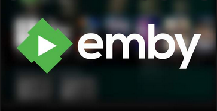

# Deliverable 3

## Different applications that can be used
There a multiple applications that you can use for your media center. These applications are Plex, Emby, jellyfin, Stremio, and Universal media server.

**Plex** - it's a global streaming media service and a client server media player platform. Plex organizes videos, audios, and photos from a users collections and from online services and streams it to players.

**Emby** - it's a media server designed to organize, play, and stream audios and videos to a variety of devices.

**Jellyfin** - it's a suite of multimedia applications designed to organize, manage, and share digital media files to networked devices. It can run on Windows, macOS, Linux, or in a Docker container.

**Stremio** - it's a modern media center that's a one-stop solution for video entertainment. You can discover, watch, and organize video content from east to install addons.

**Universal media server** - it's a DLNA, UPnP, and HTTP/S media server that supports major operating systems with versions of Windows, Linux, and macOS. This media server streams and transcodes different media formats with little to no configuration.

## Set static ip address
There are four steps to assign or set a static ip address in Windows for your media server:
1. **Shut down menu software**
   1. hit `"ctrl + tab"`
2. **Open network sharing center**
   1. navigate to `"control center"`
   2. find `"network and sharing center"`
3. **Pull up the IPv4 address**
   1. click on `"network and sharing center"`
   2. then click on `"change adapter settings"`    
   3. right-click on your `"active ethernet device"`
   4. select `"properties"`
   5. then select `"Internet protocol version 4 (TCP/IPv4)"`
   6. click `'properties"`
4. **Assign a static IP**
   1. click the button next to `"use the following IP address:"`
   2. enter your `"IP address, subnet mask, and gateway"` 
      1. (NOTE: **IF your router has DNS, NO NEED to put a DNS server in**)
   3. click `"ok"` and then `"close"` twice

## How to install the media server application
In order to install Plex into Windows you'll need to do the following steps:
- **Download the Installer from the Plex Downloads page**
- **Download the Windows Installer `.exe` file**
- **Run the Installer**
- **Follow the usual installation method**
- **At the final screen, click `Launch`**
- **Open Plex**

## How to update the media server application
You can automatically update your Plex media server, instead of doing it manually. You can do this by going into your settings and clicking on automatically download updates. This will allow for the server to update without any complications.

## How to add users 
Adding users is very simple. You will start by:
+ **Select the ADD User option**
+ **Enter the admin's account PIN**
+ **Choose a name and rating profile**
+ **Select which libraries to share**

## How to add files
Files inside of Plex are called libraries, you'll add libraries like this:
1. **Open the settings menu**
2. **Ensure the correct Plex Media Server is selected**
3. **Select libraries under the Manage section**
4. **Click add library**

## How to install the applications on the client devices
When you are in the Plex downloads page, you will go ahead and download the Plex(Player) App as well. This gives you the liberty to download it on any Android and iOS devices. Along with these devices, it can connect to Amazon Fire-TV, Apple TV, Android TV, Roku, Smart TVs, game consoles, and so much more! Not only can you install on it on your mobile devices but you can also add them onto your Windows or macOS desktops. 

## Server log files
You can save the server log files like so:
- **Go to settings**
- **Click on manage**
- **Then click on troubleshooting in Plex(Player) App**
- **Click Download logs**
- **Save zip file**

## Sources
- https://en.wikipedia.org/wiki/Plex_(company) 
- https://en.wikipedia.org/wiki/Emby 
- https://en.wikipedia.org/wiki/Jellyfin 
- https://www.stremio.com/
- https://www.universalmediaserver.com/ 
- https://www.howardcompany.com/knowledge/how-do-i-assign-a-static-ip-address-to-my-media-player 
- https://support.plex.tv/articles/200288586-installation/ 
- https://support.plex.tv/articles/203948776-managed-users/ 
- https://support.plex.tv/articles/200288926-creating-libraries/ 
- https://support.plex.tv/articles/200250417-plex-media-server-log-files/ 
- https://www.nstec.com/how-to-update-plex-software/ 