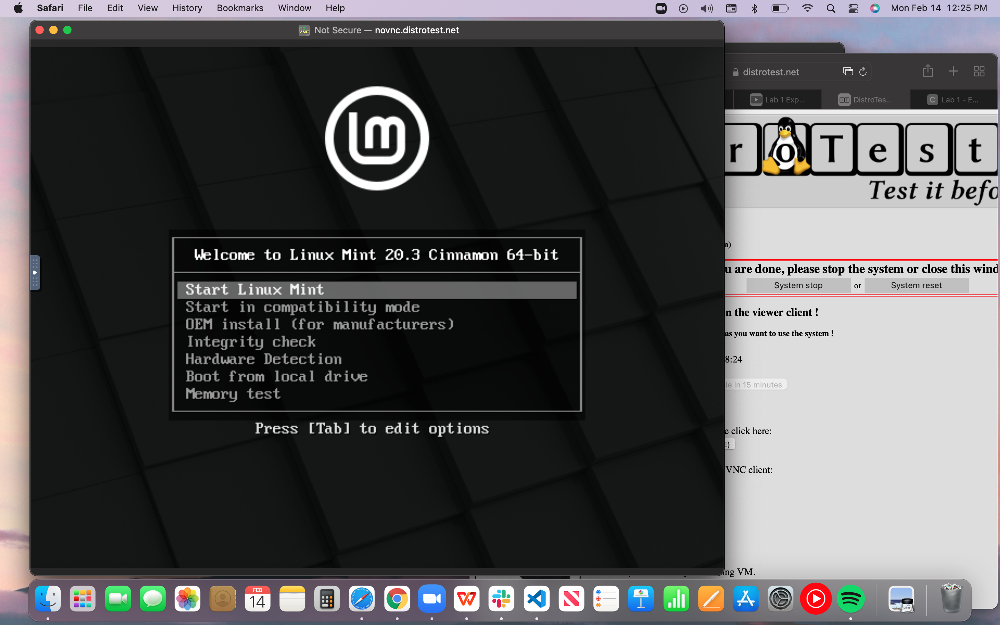
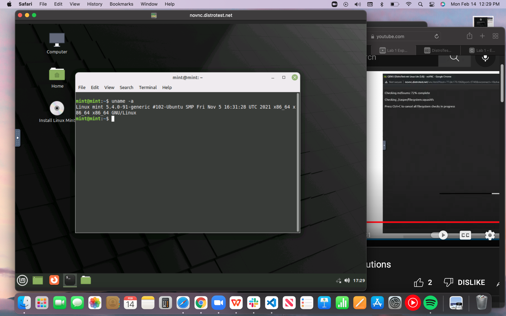
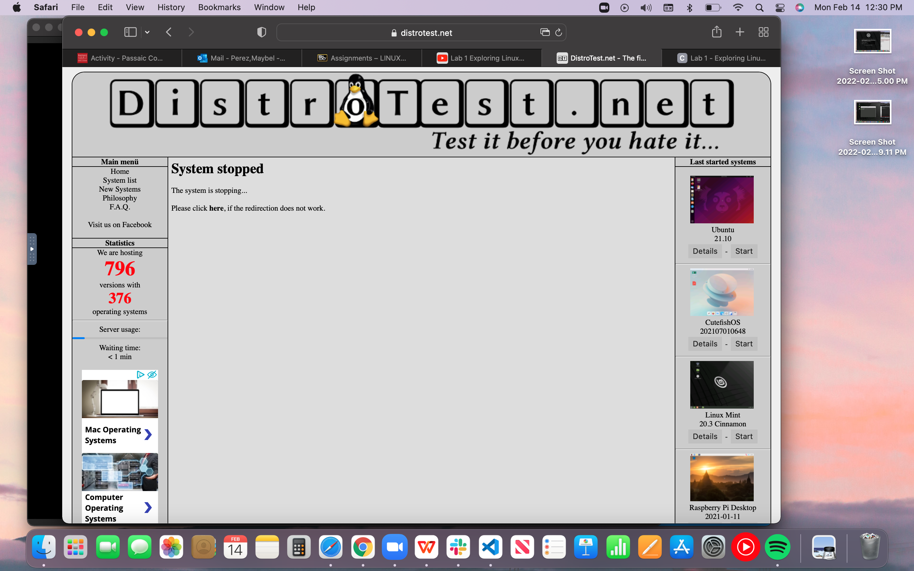

# Lab 1 Exploring Linux Distributions

## Question 1
1. What is the OS Type:
**Linux**

2. Which major distro is it based on?
**Debian**

3. Which processor architecture does it support?
**armhf, ppc64el, riscv, s390x, x86_64**

4. Is the distribution active or is it discontinued?
**Active**

5. What is the distro’s home page?
**[Home page](https://www.ubuntu.com/)**

## Question 2
1. What is the name of the distribution and the OS Type:
**The name of the distribution is: Feren OS**
**The OS Type is: Linux**

2. Which major distro is it based on?
**Debian and Ubuntu**

3. Which processor architecture does it support?
**i686, x86_64**

4. Is the distribution active or is it discontinued?
**Active**

5. What is the distro’s home page?
Type your answer here
**[Home page](http://ferenos.weebly.com/)**

## Question 3
1. What is the name of the distribution?
**MX Linux**

2. What is the country of Origin?
**Greece**

3. What major distribution is it based on?
**Debian(Stable), antiX**

4. What is the distribution category?
**Desktop, From RAM, Live Medium, Raspberry Pi**

5. Which processor architecture, aside from the one in the original query, does the OS support?
**armhf, i686, x86_64**

## Question 4
### A Linux distribution used for Data Rescue/Data recovery
| Distro name | Website | Desktop Environment |
|-------------|---------|---------------------|
| Finnix |[Website](https://distrowatch.com/table.php?distribution=finnix) | No Desktop |
### A Linux distribution used for Education that supports the ix86 processor architecture.
| Distro name | Website | Desktop Environment |
|-------------|---------|---------------------|
| NixOS | [Website](https://distrowatch.com/table.php?distribution=nixos) | Awesome, Enlightenment, Fluxbox, GNOMW, i3, IceWM, KDE Plasma, Ratpoison, Xfce |

### A Linux distribution that supports the OEM installation method
| Distro name | Website | Desktop Environment |
|-------------|---------|---------------------|
| Linux Mint | [Website](https://distrowatch.com/table.php?distribution=mint) | Cinnamon, MATE, Xfce | 

## Question 5
The EdUBudgie Linux is a version of Ubuntu Budgie Linux but instead it is pre-packaged with everything that a student might need to be successful. I don't think there is such thing as pre-packaged OS because it's probably faulty or not running correctly. Ubuntu Budgie Linux is the original package and original always works better. They want to make people get EdUBudgie instead because it has "additional packages installed and a few customizations pre-applied". EdUBudgie is probably going to stay pending for a little while longer, based on how they made Ubuntu Budgie Linux seem as unreliable. 

## Question 6

