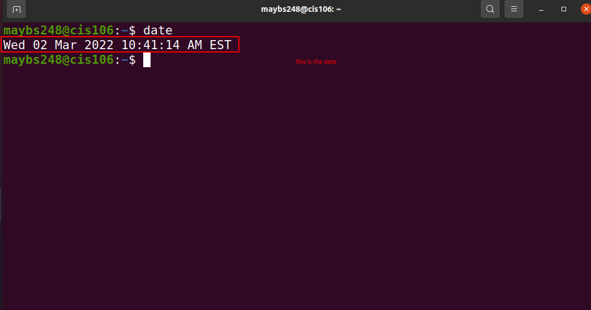
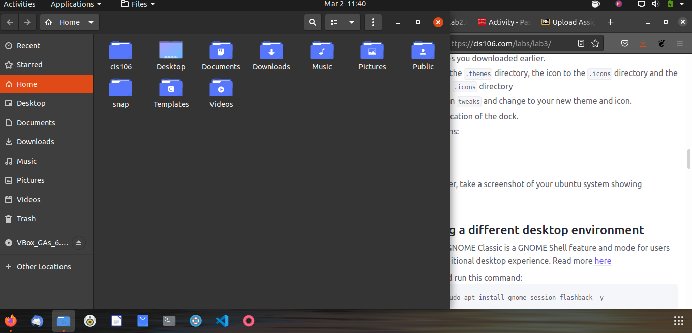
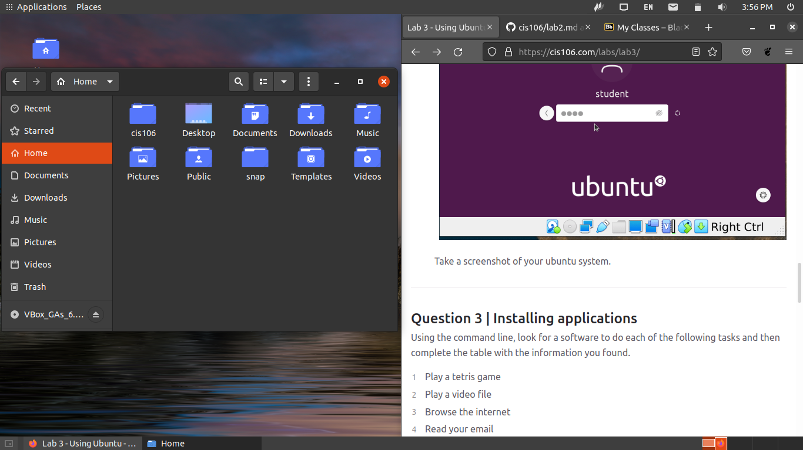

# Lab 3 Using Ubuntu

# Question 1

# Question 2

# Question 3

| Program purpose     | Package Name   | Version     | Description                            |
| ------------------- | -------------- | ----------- | -------------------------------------- |
| Play a tetris game  | quadrapassel   | 1:3.36.0-1  | popular Russian game, similar to Tetri |
| Play a video file   | dragonplayer   | 4:19.12.3-0 | simple video player                    |
| Browse the internet | junior-internet| 1.29        | Debian Jr. Internet tools              |
| Read your email     | claws-mail     | 3.17.5-2    | Fast, lightweight and user-friendly GTK+2 based email client|
| Play music          | juk            | 4:19.12.3-1 | music jukebox / music player           |

commands Answer's:
+ Sub question 1: 'sudo apt install quadrapassel dragonplayer junior-internet claws-mail juk -y'
+ Sub question 2: 'sudo apt remove quadrapassel dragonplayer junior-internet claws-mail juk -y'
+ Sub question 3: 'sudo apt install quadrapassel+ dragonplayer+ junior-internet- claws-mail- juk- vlc+'
  
# Question 4

| command | what it does                                                  |
|---------|-------------------------------------------------------------- |
| echo    | display a line of text                                        |
| fortune | print a random, hopefully interesting, adage                  |
| cowsay  | configurable speaking/thinking cow (and a bit more)           |
| lolcat  | rainbow coloring for text                                     |
| figlet  | display large characters made up of ordinary screen characters|
| toilet  | display large colourful characters                            |
| rig     | Random Identity Generator                                     |
