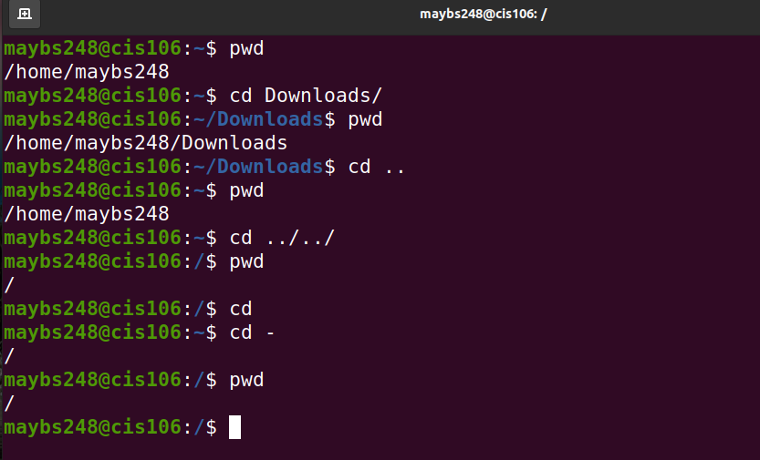
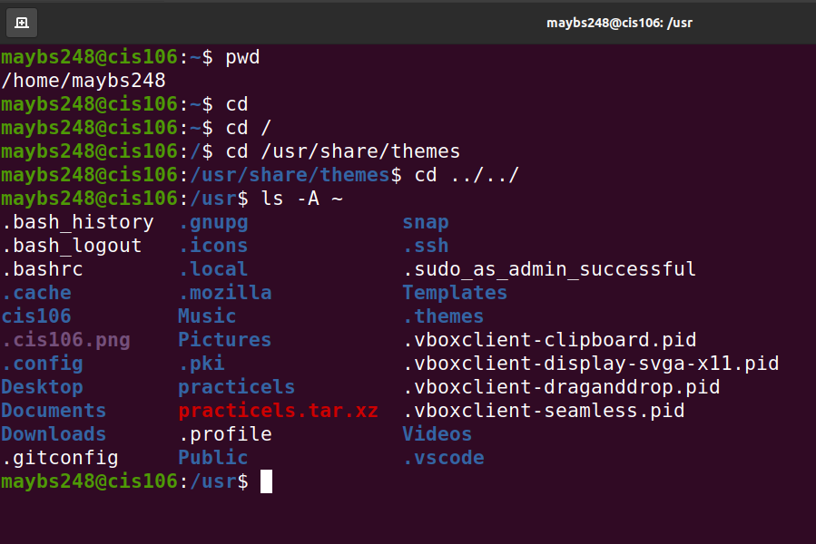
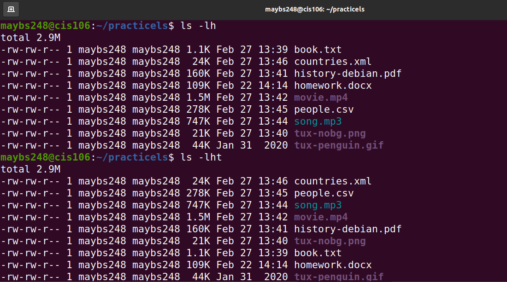

# Lab 4: The Linux fs

## Question 1:  The Linux Filesystem

| **Directories**        | **Their Usage**       |
|----------------------- |---------------------- |
| bin                    | Essential commands    |
| dev                    | Device files          |
| etc                    | System configuration files |
| home                   | User home directories |
| media                  | Mount point for removable media, such as DVDs and floppy disks |
| opt                    | Add-on software packages |
| proc                   | Kernel information, process control, system hardware information |
| srv                    | Information relating to services that run on the system |
| usr                    | Software not essential for system operation, such as applications |
| var                    | Dedicated to variable data, such as logs, databases, websites, and temporary spool (e-mail, etc) files that persist from one boot to the next |

| **Command** | **What it does** | **Syntax** | **Example** |
|------------ |----------------- |----------- |------------ |
| echo        | Display text to the screen | `echo` + `option` + `text to display` | `echo -n "Hello World"` |
| apt         | Set of tools for managing deb packages | `sudo` + `apt` + `option` + `package name` | `sudo apt install vlc` |
| uname       | Prints system information | `uname` + `option` | `uname -a` |

 

 
 
 
 
 

 
 
 
 

## Question 2: The pwd and cd command

 
 

## Question 3: The ls command

 
 
 

## Question 4: The tree command

 
 
 
 

## Question 5: The exa command, a modern tool to replace ls

 
 
 